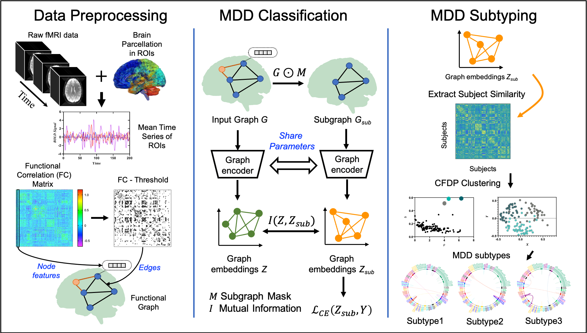
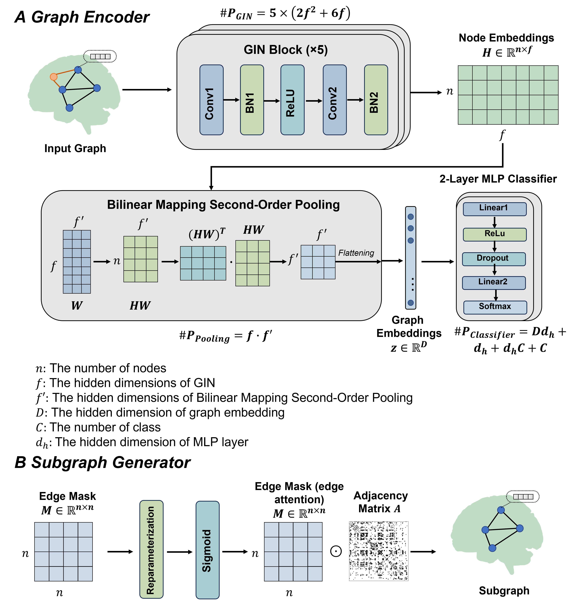

<h2 align="center">

EH-BrainGNN：Ensemble hybrid GNN framework for MDD Classification and Subtype 🔥

</h2>

## Architecture

**Figure 1 Data analysis pipeline of EH-BrainGNN.**  

**Figure 2 A schematic of the full network with parameter counts (A) and a clear statement of the role of the subgraph generator (B).**  

## Questions, Suggestions, and Collaborations

